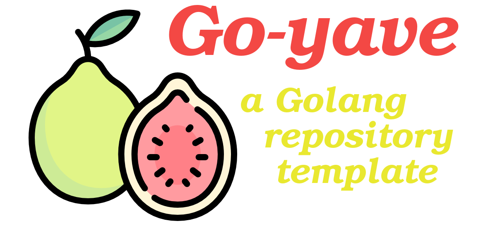

<p align="center">
  <br/>
    <br/>
    <a href="https://github.com/blyndusk/go-yave/releases">
      
    </a>
    <a href="https://github.com/blyndusk/go-yave/commits/main">
      
    </a>
    <a href="https://github.com/blyndusk/go-yave/issues">
      
    </a>
    <a href="https://github.com/blyndusk/go-yave/pulls">
      
    </a>
    <a href="https://github.com/blyndusk/go-yave/blob/main/LICENSE">
      
    </a>
</p>

<p align="center">
  <a href="https://github.com/blyndusk/go-yave/actions/workflows/web.ci.yml">
      
    </a>
       <a href="https://github.com/blyndusk/go-yave/actions/workflows/web.cd.yml">
      
    </a>
     <a href="https://github.com/blyndusk/go-yave/actions/workflows/api.ci.yml">
      
    </a>
     <a href="https://github.com/blyndusk/go-yave/actions/workflows/api.cd.yml">
      
    </a>
</p>

<p align="center">
  <a href="https://docs.github.com/en/github/creating-cloning-and-archiving-repositories/creating-a-repository-on-github/creating-a-repository-from-a-template">How to use this repo as a template for your project</a>
</p>

## I - Introduction

The purpose of this repository is to provide a **solid**, **complete** and **adaptable** base of a [Golang](https://golang.org/)-oriented product in a **project-managed** repository, in order to start a new project with a **maximum time saving**.

This repository provides **commit writting** and **branch naming conventions**, **issues** and **pull request templates**, and a **custom issues labels preset**.

But also **CI/CD** and **release** using [GitHub Actions](https://github.com/features/actions), [GitHub Container Registry](https://github.com/features/packages) and [Docker](https://www.docker.com/).

And finally, a simple **RESTful API**, using [Golang](https://golang.org/), [Postgres](https://www.postgresql.org/) and [Adminer](https://www.adminer.org/), build with [Docker](https://www.docker.com/) and [Docker Compose](https://docs.docker.com/compose/), using a [Makefile](<https://en.wikipedia.org/wiki/Make_(software)>).

> This repository gathers all the good practices that I have learned over time, both in terms of **organization** and **good maintenance** of a project over time as well as in terms of **automation, availability** and **consistancy**.

## II - Table of content

- [I - Introduction](#i---introduction)
- [II - Table of content](#ii---table-of-content)
- [III - Folder structure](#iii---folder-structure)
- [IV - Conventions, templates and labels](#iv---conventions-templates-and-labels)
  - [A - Commit conventions](#a---commit-conventions)
  - [B - Branch naming convention](#b---branch-naming-convention)
  - [C - Issue template](#c---issue-template)
  - [D - Pull request template](#d---pull-request-template)
  - [E - Custom issues labels preset](#e---custom-issues-labels-preset)
- [V - CI/CD, release and container registry](#v---cicd-release-and-container-registry)
  - [A - CI](#a---ci)
  - [B - CD](#b---cd)
  - [C - Release](#c---release)
  - [D - Labeler](#d---labeler)
- [VI - Project setup](#vi---project-setup)
  - [A - Stack](#a---stack)
  - [B - Makefile](#b---makefile)
- [VII - Contributing](#vii---contributing)
- [VIII - License](#viii---license)

## III - Folder structure

The structure of this project follows [these conventions](https://github.com/golang-standards/project-layout).

- `/.github`: Conventions, template, labels, ci, cd, settings
- `/cmd`: main files
- `/build`: Dockerfiles
- `/config`: Environment files
- `/deploy`: Docker Compose files
- `/internal`: "private" code
- `/pkg`: "public" code
- `/scripts`: Makefile bash scripts for setup/install/start

## IV - Conventions, templates and labels

### A - Commit conventions

```
tag(scope): #issue_id - message
```

See [COMMIT_CONVENTIONS.md](assets/docs/COMMIT_CONVENTIONS.md) for more informations.

### B - Branch naming convention

```
type_scope-of-the-work
```

See [BRANCH_NAMING_CONVENTIONS.md](assets/docs/BRANCH_NAMING_CONVENTIONS.md) for more informations.

### C - Issue template

See [user-story.md](.github/ISSUE_TEMPLATE/user-story.md) for more informations.

### D - Pull request template

See [pull_request_template.md](.github/pull_request_template.md) for more informations.

### E - Custom issues labels preset

The labels preset is located at [.github/settings.yml](.github/settings.yml).

You can **add, edit or remove** them. To automatically update these labels, you need to **install** the ["Settings" GitHub app](https://github.com/apps/settings), which will **syncs repository settings defined in the file above to your repository**.

## V - CI/CD, release and container registry

### A - CI

[](https://github.com/blyndusk/go-yave/actions/workflows/ci.go.yml)

The **CI** workflow is located at [.github/workflows/ci.go.yml](.github/workflows/ci.go.yml). It's triggered a **each push** on **all branches**.

It consist of:

- **install Golang** on the VM
- get the dependancies **using the cache of other Actions run**
- **lint the files** to check or syntax errors
- **build** the application

### B - CD

[](https://github.com/blyndusk/go-yave/actions/workflows/cd.docker.yml)

The **CD** workflow is located at [.github/workflows/cd.docker.yml](.github/workflows/cd.docker.yml). It's triggered a **each push** on **`main` branch**.

It consist of:

- **login** into the GitHub container registry (ghcr.io)
- **build and push** the Golang api using the **production Dockerfile** located at [build/pakage/sample-api/Dockerfile](build/pakage/sample-api/Dockerfile)

After that, you can check the **pushed container** at: `https://github.com/<username>?tab=packages&repo_name=<repository-name>`

> IMPORTANT: you need to **update the production Dockerfile** with your **username** AND **_repository name_**. Otherwise, there will be errors at push:

```bash
LABEL org.opencontainers.image.source = "https://github.com/<username>/<repository-name>"
```

### C - Release

[](https://github.com/blyndusk/go-yave/actions/workflows/md.release.yml)

The **release** workflow is located at [.github/workflows/md.release.yml](.github/workflows/md.release.yml). It's triggered **manually by user input** at: [Actions > RELEASE](https://github.com/blyndusk/go-yave/actions/workflows/md.release.yml).

> IMPORTANT: you need to set the **image tag** in the action input, for the action to be able to push the docker image and create a release **with a specific version**. The image tag is a [SemVer](https://en.wikipedia.org/wiki/Software_versioning) tag, e.g. `1.0.2`.

It consist of:

- check if the **environment match the branch**
- do the CD (docker) action again, but **with a specific image tag**
- create a release **with the same tag**, filled with the **generated changelog as closed issues since the last release**

After that, you can check the release at `https://github.com/<username>/<repository-name>/releases`.

### D - Labeler

[](https://github.com/blyndusk/go-yave/actions/workflows/ci.labeler.yml)

The **labeler** workflow consists in **assigning specific labels** on **pull requests** according to the files that have been modified in the **commits attached to this pull request**.


## VI - Project setup

The project use **Docker** and **Docker Compose** to build and run local and distant images in our workspace.

### A - Stack

All the images use the **same network**, more informations at [docker-compose.yml](docker-compose.yml)

| CONTAINER | PORT        | IMAGE                                                                    |
| :-------- | :---------- | :----------------------------------------------------------------------- |
| GOLANG    | `3333:3333` | [build/pakage/sample-api/Dockerfile](build/pakage/sample-api/Dockerfile) |
| ADMINER   | `3334:8080` | [build/package/adminer/Dockerfile](build/package/adminer/Dockerfile)     |
| POSTGRES  | `5432:5432` | [postgres:latest](https://hub.docker.com/_/postgres)                     |

> Adminer is a GUI that allows us to **manage your database** by permetting to to **create, edit, delete** the different entities, tables, etc.

### B - Makefile

#### TL;DR <!-- omit in toc -->

```bash
make setup-env start logs
```

#### `make help` <!-- omit in toc -->

**Display** informations about other commands.

#### `make setup-env` <!-- omit in toc -->

**Copy** the sample environment files.

#### `make start` <!-- omit in toc -->

Up the containers with **full cache reset** to avoid cache errors.

#### `make stop` <!-- omit in toc -->

**Down** the containers.

#### `make logs` <!-- omit in toc -->

**Display and follow** the logs.

#### `make lint` <!-- omit in toc -->

**Lint** the Go files using `gofmt`.

## VII - Contributing

See [CONTRIBUTING.md](assets/docs/CONTRIBUTING.md) for more informations.

## VIII - License

Under [MIT](./LICENSE) license.
